# AppFlowy Branch Migration History

**Version:** 1.0
**Date:** 2025-11-08
**Status:** ✅ Migration Complete

---

## Quick Summary

The `appflowy` branch (28 commits with password management features) diverged from `master` 251 commits ago. We created `appflowy2` to systematically merge these features into current master.

**Result:** `appflowy2` = master (latest) + appflowy (features)

---

## Branch Relationships

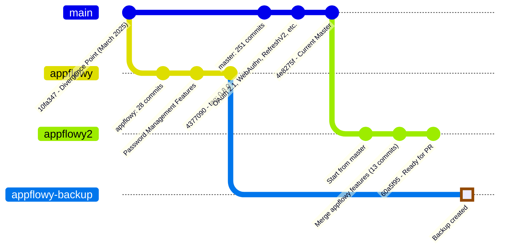

---

## Branch Timeline

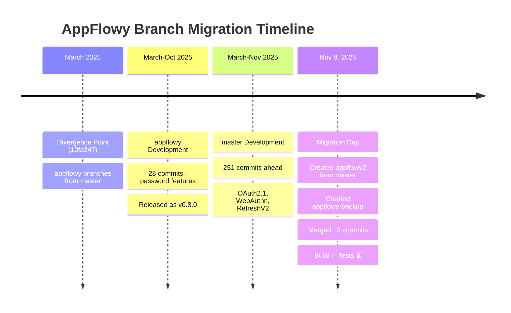

---

## Why appflowy2 Exists

### The Problem

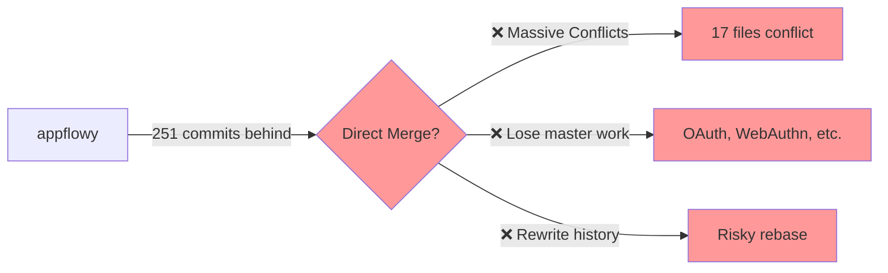

### The Solution

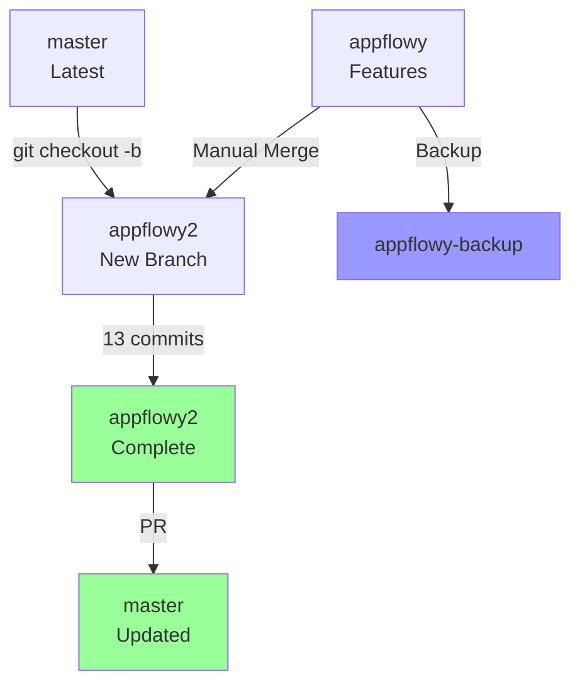

---

## Branch Status

| Branch | Status | Purpose | Delete After Merge? |
|--------|--------|---------|-------------------|
| `master` | ✅ Active | Main development | ❌ Never |
| `appflowy` | 🟡 Historical | Original work (v0.8.0) | ⚠️ After PR merged |
| `appflowy-backup` | 🔵 Backup | Preserves original | ✅ Optional |
| `appflowy2` | ✅ Active | Merge branch | ✅ After PR merged |

---

## Migration Flow

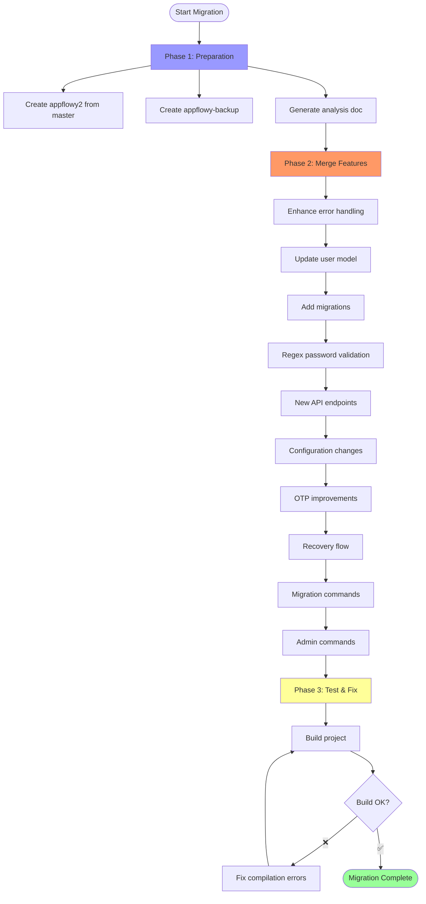

---

## What Was Merged

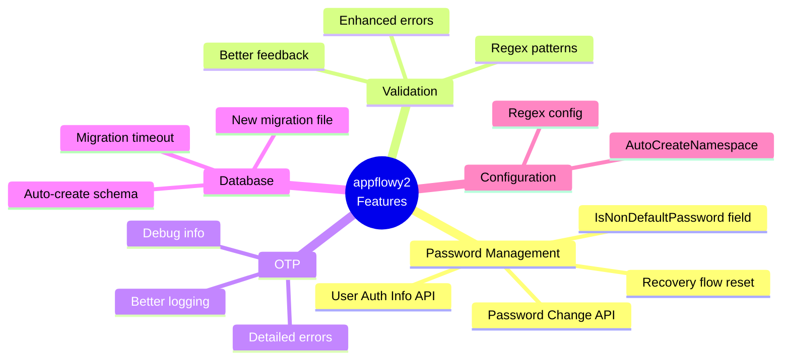

---

## Commit Mapping Summary

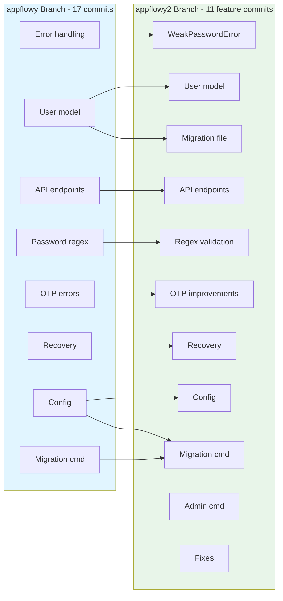

**Mapping Types:**
- ✅ 1:1 (7 commits)
- 🔀 1:Many (2 commits split)
- 🔗 Many:1 (9 commits combined)

📄 **Detailed mapping:** See `APPFLOWY_COMMIT_MAPPING.md`

---

## Files Changed

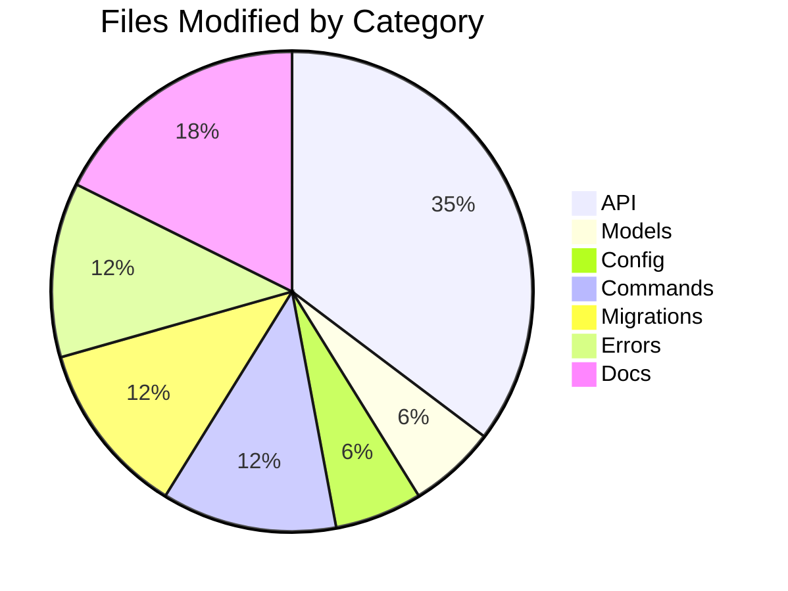

**Total:** 17 files changed, ~800 lines added

---

## Next Steps

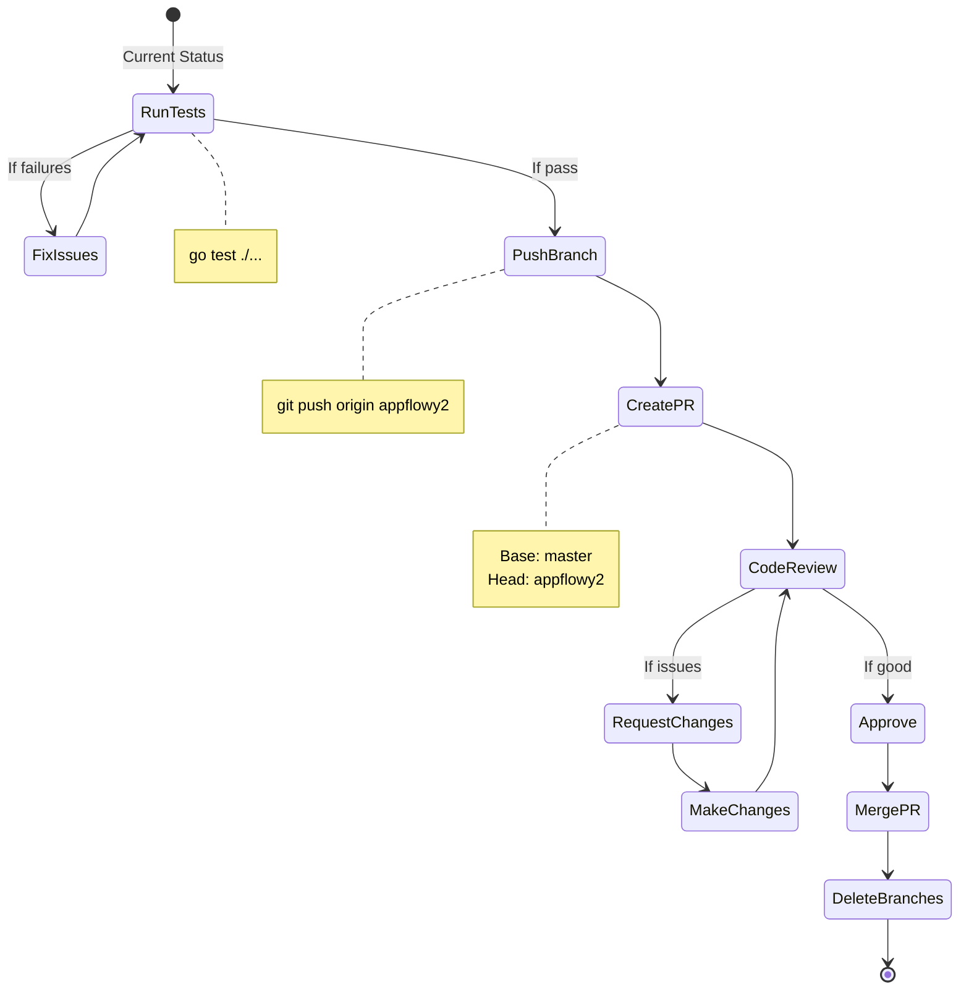

### Commands to Execute

```bash
# 1. Run tests
go test ./...

# 2. Push branch
git push origin appflowy2

# 3. Create PR
gh pr create --base master --head appflowy2 \
  --title "Merge AppFlowy password management features" \
  --body "$(cat APPFLOWY_MERGE_ANALYSIS.md)"

# 4. After merge
git checkout master
git pull origin master
git branch -d appflowy2
```

---

## Quick Reference

### View Branch Differences

```bash
# Compare appflowy to master
git log master..origin/appflowy --oneline

# Compare appflowy2 to master
git log master..appflowy2 --oneline

# See what appflowy2 merged
git diff master..appflowy2 --stat
```

### View Specific Changes

```bash
# Password validation
git show appflowy2:internal/api/password.go

# User model
git show appflowy2:internal/models/user.go

# API routes
git show appflowy2:internal/api/api.go
```

---

## Documentation Index

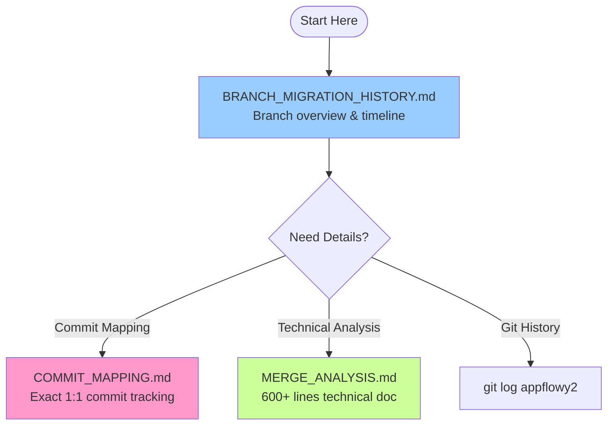

**Read in this order:**
1. **This document** - Understand why and what
2. **APPFLOWY_COMMIT_MAPPING.md** - Understand how (commit relationships)
3. **APPFLOWY_MERGE_ANALYSIS.md** - Understand details (technical deep-dive)

---

## Summary

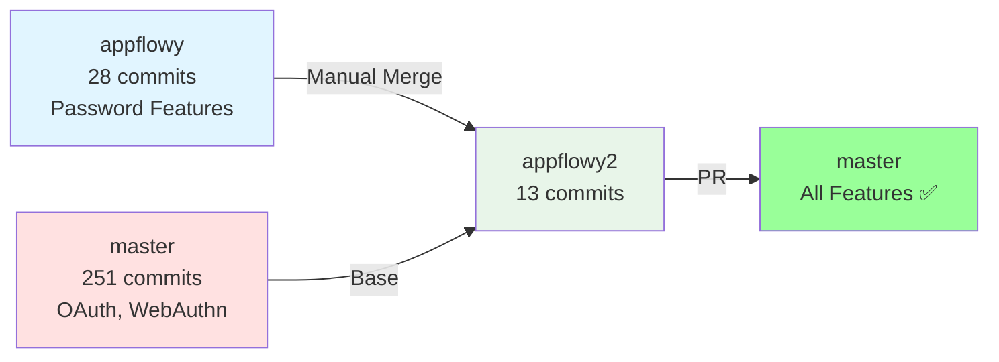

**Result:** Successfully merged 17 appflowy commits → 11 appflowy2 commits

**Status:** ✅ Build passes | ⏳ Tests pending | 📝 Ready for PR

---

**Last Updated:** 2025-11-08
**Document:** APPFLOWY_BRANCH_MIGRATION_HISTORY.md
**Version:** 1.0
