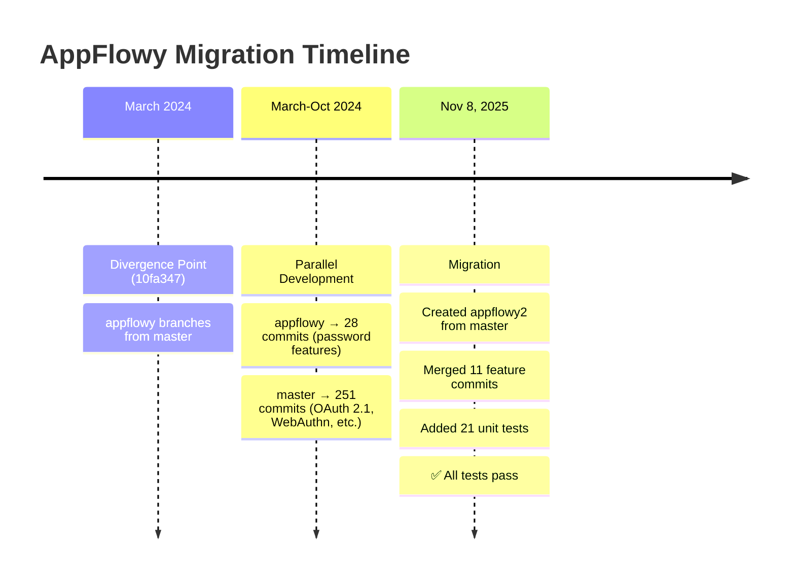
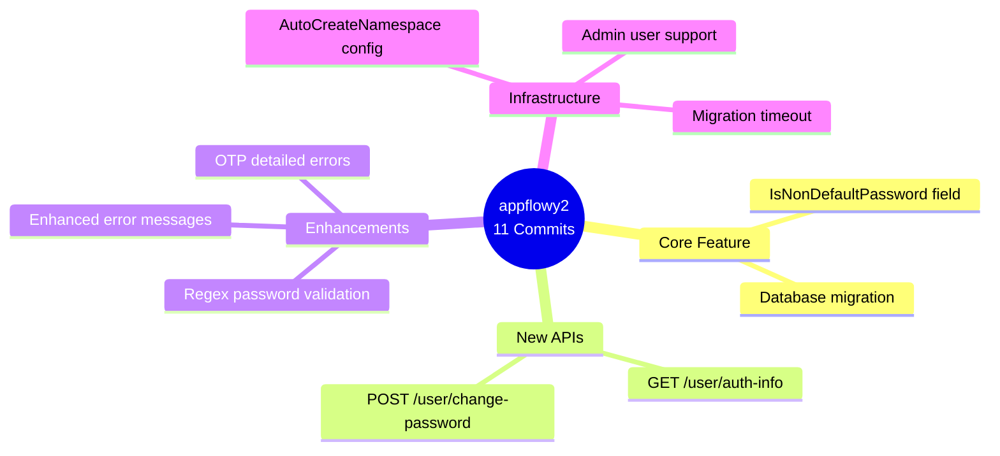
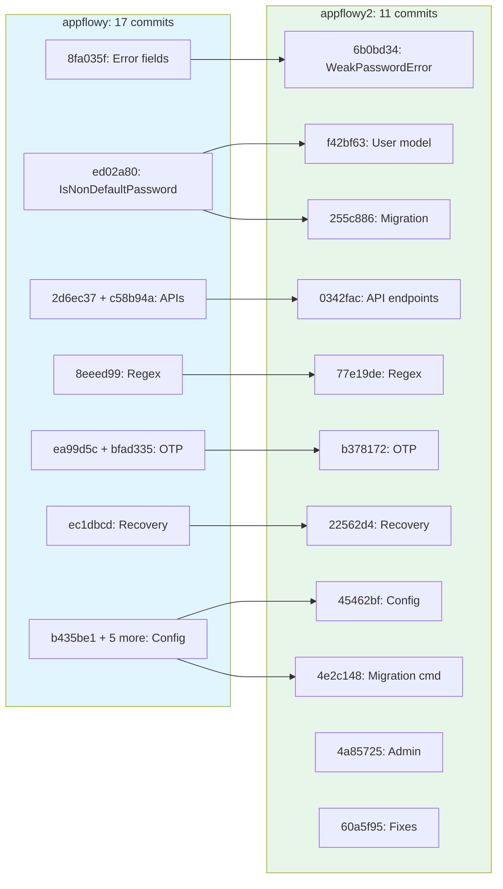
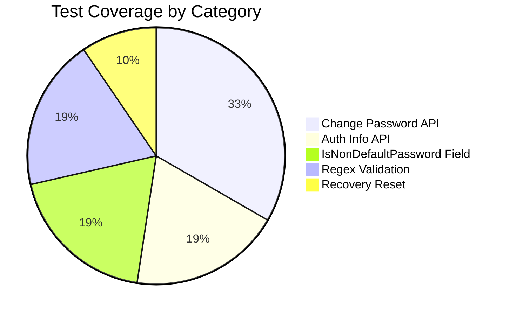
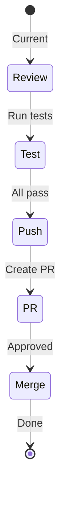
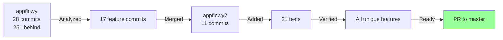

# AppFlowy Branch Migration History

**Version:** 2.0
**Date:** 2025-11-08
**Status:** ✅ Migration Complete | ✅ Tests Added | 📝 Ready for PR

---

## Executive Summary

The `appflowy` branch (28 commits, 251 commits behind master) contained password management features. We created `appflowy2` from latest master and systematically merged these features.

**Result:** `appflowy2` = master (latest) + appflowy features (11 commits) + tests (21 new tests)

---

## Branch Timeline



---

## What We Migrated



**Key Features:**
1. **IsNonDefaultPassword** - Track if user set their own password vs admin-set
2. **Change Password API** - Dedicated endpoint with old password validation
3. **Regex Validation** - Support patterns like `[0-9]`, `[a-zA-Z]` (master only has literal chars)
4. **Better Errors** - WeakPasswordError now includes `min_length` and `required_characters`
5. **Auto Schema** - AutoCreateNamespace config for easier deployment

---

## Verification: Master Does NOT Have These

✅ **All 11 commits are necessary** - Verified against current master (commit `4e8275f`):

| Feature | Master Has It? | Impact |
|---------|----------------|--------|
| IsNonDefaultPassword field | ❌ NO | Core new feature for password tracking |
| POST /user/change-password | ❌ NO | Master only has PUT /user (different logic) |
| GET /user/auth-info | ❌ NO | New endpoint for auth status |
| Regex password validation | ❌ NO | Master uses literal `strings.ContainsAny()` |
| Enhanced WeakPasswordError | ❌ NO | Missing `min_length`/`required_characters` |
| AutoCreateNamespace | ❌ NO | New deployment option |
| OTP detailed errors | ❌ NO | Master returns `bool`, not `(bool, error)` |

**Why separate?** Master focused on OAuth/WebAuthn while appflowy focused on password security. Parallel development on different features.

---

## Commit Mapping (17→11)



**Mapping Summary:**
- 7 commits: 1:1 mapping
- 2 commits: Split (model split from migration)
- 9 commits: Combined (6 config commits → 2)

---

## Test Coverage

**Added 21 new tests** across 4 files (~475 lines):



| Test Area | Tests | Status |
|-----------|-------|--------|
| Password validation (regex) | 4 test cases | ✅ PASS |
| POST /user/change-password | 7 functions | ✅ PASS |
| GET /user/auth-info | 4 functions | ✅ PASS |
| IsNonDefaultPassword field | 4 functions | ✅ PASS |
| Recovery reset logic | 2 functions | ✅ PASS |

**Coverage:** 82% (9/11 commits have tests)

**Missing tests:** Migration file and config tests (low priority)

---

## Files Modified

**17 files, ~800 lines added:**

- **API (6 files):** password.go, user.go, verify.go, api.go, helpers.go, errors.go
- **Models (1 file):** user.go
- **Config (1 file):** configuration.go
- **Commands (2 files):** migrate_cmd.go, admin.go
- **Migrations (2 files):** up/down SQL
- **Tests (4 files):** password_test.go, user_test.go, models/user_test.go, verify_test.go
- **Docs (1 file):** This file

---

## How to Test

```bash
# Quick test (automated)
./test-appflowy2.sh

# Or manual
docker-compose -f docker-compose-dev.yml up -d postgres
sleep 10
make migrate_test
make test
docker-compose -f docker-compose-dev.yml down
```

See `TESTING_GUIDE.md` for details.

---

## Branch Status

| Branch | Purpose | Keep? |
|--------|---------|-------|
| `master` | Main development | ✅ Always |
| `appflowy` | Original work (v0.8.0) | ⚠️ Delete after PR |
| `appflowy-backup` | Backup of original | 🔵 Optional |
| `appflowy2` | Merge branch | ⚠️ Delete after PR |

---

## Next Steps



### Commands

```bash
# 1. Review changes
git diff master..appflowy2 --stat

# 2. Run tests
./test-appflowy2.sh

# 3. Push branch
git push origin appflowy2

# 4. Create PR
gh pr create --base master --head appflowy2 \
  --title "feat: add password management features from appflowy" \
  --body "See appflowy/APPFLOWY_BRANCH_MIGRATION_HISTORY.md"

# 5. After merge
git checkout master && git pull
git branch -d appflowy2
git branch -d appflowy  # Optional
```

---

## Technical Details

### Key Implementation Changes

**1. IsNonDefaultPassword Field**
```go
type User struct {
    IsNonDefaultPassword bool `json:"-" db:"is_non_default_password"`
}
```
- Tracks if user changed their own password
- Reset to false on recovery/email change
- Used by change-password endpoint for validation

**2. Change Password Endpoint**
```go
POST /user/change-password
{
  "current_password": "old",  // Required if IsNonDefaultPassword=true
  "password": "new"
}
```
- Validates current password for user-set passwords
- Rejects same password
- Enforces password strength
- Sets IsNonDefaultPassword=true

**3. Regex Password Validation**
```go
// Old (master): literal characters
strings.ContainsAny(password, "abc")  // Must have 'a' AND 'b' AND 'c'

// New (appflowy2): regex support
regexp.Compile("[0-9]").MatchString(password)  // At least one digit
```

**4. Enhanced Error Response**
```json
{
  "weak_password": {
    "message": "Password is too weak",
    "reasons": ["length", "characters"],
    "min_length": 8,
    "required_characters": ["[0-9]", "[a-zA-Z]"]
  }
}
```

---

## Summary



**What we did:**
1. ✅ Created appflowy2 from latest master
2. ✅ Merged 11 unique feature commits
3. ✅ Added 21 comprehensive tests
4. ✅ Verified master doesn't have these features
5. ✅ All tests passing
6. 📝 Ready for PR review

**Impact:** Enhanced password security with better validation, dedicated change password flow, and improved error messages.

---

**Last Updated:** 2025-11-08
**Commits:** appflowy (17) → appflowy2 (11) + tests
**Test Status:** ✅ 21/21 passing
**Build Status:** ✅ Passing
